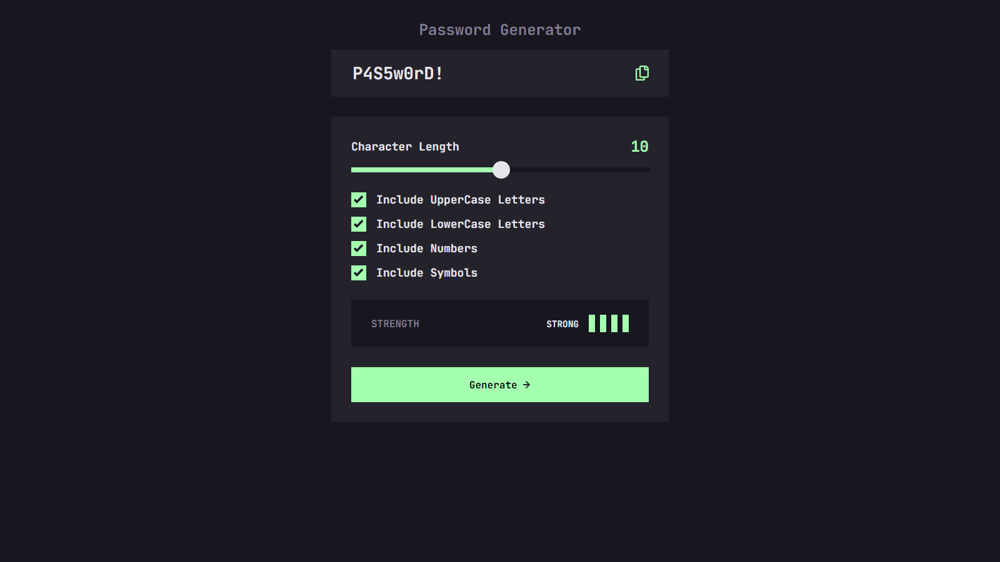

# Frontend Mentor - Password generator app

This is a solution to the [Password generator app](https://www.frontendmentor.io/challenges/password-generator-app-Mr8CLycqjh). Frontend Mentor challenges help you improve your coding skills by building realistic projects.

## Table of contents

- [Overview](#overview)
  - [The challenge](#the-challenge)
  - [Screenshot](#screenshot)
  - [Links](#links)
  - [Built with](#built-with)
  - [What I learned](#what-i-learned)
  - [Useful resources](#useful-resources)
- [Author](#author)
- [Acknowledgments](#acknowledgments)

**Note: Delete this note and update the table of contents based on what sections you keep.**

## Overview

This is a Password Generator. I added the extra feature of being able to type in the input box and get updates on the strength of the password.

### The challenge

Users should be able to:

- View the optimal layout for the site depending on their device's screen size
- See hover states for all interactive elements on the page

### Screenshot



### Links

- Solution URL: [Add solution URL here](https://your-solution-url.com)
- Live Site URL: [Add live site URL here](https://your-live-site-url.com)

### Built with

- Semantic HTML5 markup
- CSS custom properties
- Flexbox
- Mobile-first workflow

### What I learned

#### Styling Range Inputs

Inputs with type="range" are very tricky to style. There are a lot of puedo elements to use such as (::-webkit-slider-thumb) for the thumb and (::-webkit-slider-runnable-track) for the track styles. There are unique selectors for each browser.

```
ms => edge, IE
webkit => chrome based browsers
moz => firefox
```

So the CSS ends up looking like this

```css
/* track */
input[type="range"]::-moz-range-track {
  background-color: var(--black);
  height: 8px;
}
input[type="range"]::-ms-track {
  background-color: var(--black);
  height: 8px;
}
input[type="range"]::-webkit-slider-runnable-track {
  background-color: var(--black);
  height: 8px;
}
```

I searched long and hard for a way to style the progress part (left section of the slider handle) of the range input with CSS. I could not find a way so I just styled it with JavaScript.

#### Copy to Clipboard

To be able to click on an image and copy the password to clipboard is a very cool feature. It saves the user over 1000 milleseconds of time over highlighting, right clicking and selecting copy. In order to use this feature I had to rely on a browser API called navigator.

It is actually prety simple to use.

```js
//grab password
const passwordText = document.getElementById("password-text");
let copyContent = passwordText.value;

//add password element text to clipboard
navigator.clipboard.writeText(copyContent);
```

#### Custom Checkbox Styling

It took a little bit more work than I thought in order to add custom checkbox styling on the click of the checkbox.
The HTML is simple. Just a label, the input type="checkbox", and a span to add the custom styles to.

```html
<label>
  <input type="checkbox" name="uppercase" id="uppercase" />
  <span class="checkmark"></span>
  Include UpperCase Letters
</label>
```

First I needed to erase the default checkbox from showing and then add styling to the span

```css
input[type="checkbox"] {
  margin-right: 20px;
  /* hide styles */
  position: absolute;
  opacity: 0;
  height: 0;
  width: 0;
}

/* custom checkbox */
span.checkmark {
  cursor: pointer;
  position: absolute;
  top: 0;
  left: -40px;
  height: 20px;
  width: 20px;
  border: 2px solid var(--light);
}
```

Then I used JavaScript to toggle the styling on click

```js
//grab all checkbox elements
const checkboxElements = Array.from(
  document.querySelectorAll("input[type='checkbox']")
);

//add event listeners to change checked attribute
checkboxElements.forEach((element) => {
  //automatically check lowercase
  if (element.id === "lowercase") {
    element.checked = true;
  } else {
    element.checked = false;
  }
  element.addEventListener("click", handleCheck);
});

//apply styles to the span when checkbox is checked
function handleCheck(e) {
  const el = e.target;
  const parentLabel = el.parentElement;
  const customCheckbox = parentLabel.querySelector("span");
  customCheckbox.classList.toggle("checked");
}
```

### Useful resources

- [Range Input Styling Youtube Tutorial](https://www.youtube.com/watch?v=Ow0QjqmaRtQ) - This went deeper than I needed but it was very useful.
- [W3Schools How to style custom chekbox](https://www.w3schools.com/howto/howto_css_custom_checkbox.asp) - I like this article it is quick and easy to skim through instead of some long video.
- [MDN navigaotr.writeText() article](https://developer.mozilla.org/en-US/docs/Web/API/Clipboard/writeText) - This article is hard to read in my oppinion but it helped me figure out how to copy to clipboard. I'm pretty sure there are some good [Youtube Videos](https://www.youtube.com/results?search_query=javascript+copy+to+clipboard) on it.

## Author

- Website - [Add your name here](https://www.your-site.com)
- Frontend Mentor - [@yourusername](https://www.frontendmentor.io/profile/yourusername)

## Acknowledgments

Shout out to YouTube tutorials for making all of this possible.
